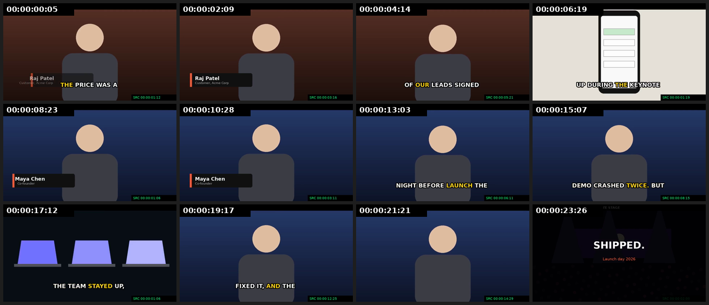

# How an AI Agent Actually Edits Video: Mechanics, Stack and the Bet

> Companion to [`EXPLORATION.md`](./EXPLORATION.md). This one answers the concrete questions:
> **How does text become a video? What does the agent physically do? What do we use? How do motion graphics work? What's the bet?**
>
> Everything here is backed by a **working prototype** in [`prototype/`](./prototype). Run `python3 prototype/demo.py` and it goes brief → agent tool calls → timeline → self-review → rendered MP4, then takes a second round of user feedback and re-renders.

---

## 1. The short answer: text never "turns into video"

The mental model that trips people up is `text → AI → video`, as if a model paints the output. For **editing your footage**, that's wrong. The actual pipeline is:

```
 "45-sec launch recap, hook fast, customer proof, end on energy"          ← intent (text)
                         │  LLM reasons over the FOOTAGE INDEX
                         ▼
 PAPER EDIT:  1.HOOK Maya "we almost didn't ship"  2.STORY …  3.PROOF Raj …  ← plan (text, human-approvable)
                         │  LLM emits TOOL CALLS
                         ▼
 insert_soundbite(maya, words 0-5) · cover_with_broll(c2, team_night, word 16) · add_lower_third(…)   ← semantic tool calls
                         │  deterministic code compiles to frame-exact OPS
                         ▼
 {"op":"insert_clip","media":"maya","src_in":14,"src_out":120,…}   ← timeline ops (the only way to mutate)
                         │
                         ▼
 TIMELINE (JSON): tracks → items → source ranges, effects, graphics, provenance   ← the "program"
                         │  RENDERER compiles it
                         ▼
 decoded source frames → GPU compositor (+ motion-graphics layers) → encoder → MP4  ← pixels
```

**The pixels come from your footage.** The AI decides *which frames, in what order, with what on top*. That's why the output is faithful (no invented faces or words), cheap (no GPU-hours of generation) and **editable** (every decision is a row in a timeline you can drag).

**Analogy:** a film editor in 1960 never painted film. They **cut and spliced** strips from the rushes and wrote down every splice in a log (the EDL). Our agent is that editor, and the timeline JSON is the splice log. The renderer is the lab that prints the final reel.

Generative models (Veo, Runway, Kling, Wan) do appear, but **as tools inside the edit**, e.g. "generate 2 seconds of b-roll of a warehouse because we have none". They're never the main path (see §7).

---

## 2. A real trace from the prototype

This is the actual output of `prototype/demo.py`, lightly trimmed. The footage is synthetic: two "interviews" (Maya the co-founder, Raj the customer), four b-roll shots (one deliberately blurry) and a music track. The ingest step produced the index: word-level transcript, shot descriptions and quality scores.

### Turn 1: the brief
> *"45-second launch-day recap for LinkedIn. Hook fast, tell the 'almost didn't ship' story, add customer proof, end on energy. Name people on screen."*

**The agent reads before it acts** (these are retrieval tools, and nothing changes yet):
```
→ search_footage("interview talking customer", kind="interview")
→ get_transcript("maya")
    [0]Honestly, [1]we [2]almost [3]didn't [4]ship [5]this. [6]Um, [7]the [8]night … [26]amazing.
→ get_transcript("raj")
    [0]Uh, [1]the [2]price [3]was [4]a [5]no-brainer … [17]itself.
```
Notice the **word indices**. The LLM cites *words*, never timestamps. It's excellent at "from 'Honestly' to 'this.'" and bad at "from 00:00:00.487 to 00:00:04.013".

**It writes a paper edit and shows it to the user first** (cheap to change, and easy to read):
```
1. HOOK   Maya [0-5]   "Honestly, we almost didn't ship this."          + lower third
2. STORY  Maya [6-26]  "…demo crashed twice. But the team stayed up…"  + b-roll: team at night
3. PROOF  Raj  [0-17]  "…price was a no-brainer… signed up…"            + lower third, b-roll: sign-up
4. OUTRO  stage b-roll, title "LAUNCH DAY"; music bed under everything
```

**Then it assembles.** Each tool call returns a *diff*, which is what the UI would highlight:
```
→ insert_soundbite(media="maya", from_word=0, to_word=5, reason="hook: stakes in one line")
    + V1:c1 [maya 14-120] @ 00:00:00:00  (hook: stakes in one line)
→ search_footage("team laptops night working", kind="broll")
    [[1.0, "broll_team_night", …], …]      ← blurry crowd shot is penalized by its quality score
→ cover_with_broll(clip="c2", media="broll_team_night", from_word=16, seconds=3.0)
    + V2:c4 [broll_team_night 0-90] @ 00:00:08:28
→ add_lower_third(clip="c1", name="Maya Chen", title="Co-founder")
→ add_title(clip="c6", text="LAUNCH DAY", subtitle="Thank you for building with us")
→ add_music(media="music_upbeat", gain_db=-9)
```

**It reviews its own draft** and fixes what it finds:
```
→ review()
    ["c2 still contains filler 'Um,'", "c3 still contains filler 'Uh,'"]
→ remove_words(clip="c2", from_word=6, to_word=6)
    + V1:c11 [maya 145-454]      - V1:c2 [maya 122-454]
    ~ V2:c4 [broll_team_night]: moved 00:00:08:28 -> 00:00:08:05   ← b-roll followed its sentence
    ~ G1:g9 [title_card]: moved …                                   ← everything downstream rippled
→ review()
    []
```
→ renders `cut_v1.mp4` (25.9 s).

### Turn 2: user feedback
> *"Open with Raj's no-brainer line, it's a stronger hook. And make the end title say SHIPPED."*
```
→ clips()                                   ← agent re-reads current state (ids changed after edits!)
→ move_clip(clip="c12", index=0)
    ~ V1:c12 [raj 37-278]: moved 00:00:13:25 -> 00:00:00:00
    ~ V2:c5 [broll_signup]: moved 00:00:18:25 -> 00:00:05:00   ← connected b-roll moved WITH Raj
    ~ G1:g8 [lower_third]: moved 00:00:13:25 -> 00:00:00:00    ← his name tag moved too
→ update_graphic(item="g9", text="SHIPPED.", subtitle="Launch day 2026")
```
→ renders `cut_v2.mp4`. Every step was one transaction, so the undo stack is 14 deep.

**Contact sheet of cut v2** (the burned-in `SRC` timecode proves each frame came from the exact source frame the timeline says):


**A real bug, left in on purpose:** at 00:00:00:05 the "Raj Patel" lower third overlaps the caption. My rule-based `review()` didn't catch it, because no rule checks layout collisions. This is exactly why the product needs a **second review layer, a VLM that watches the rendered preview** (§5). The rules catch what you can predict. The VLM catches what you can see.

---

## 3. The tool layer: the most underrated design problem

The agent is only as good as its tools. Three levels:

| Level | Example | Who uses it |
|---|---|---|
| **Raw ops** | `insert_clip(src_in=145, src_out=454)`, `split(src_frame=122)`, `cut_range`, `ripple_delete`, `trim(edge, delta)`, `move_clip` | the UI and the tool layer. **Never the LLM directly** |
| **Semantic tools** | `insert_soundbite(media, from_word, to_word)`, `remove_words`, `cover_with_broll(clip, media, from_word)`, `add_lower_third(clip, name)` | **the LLM** |
| **Skills / recipes** | "podcast → 3 vertical clips", "event recap", "testimonial cut" | LLM-orchestrated sequences + prompts |

### Rules that make it work (all implemented in the prototype)

1. **Semantic units in, frame-exact numbers out.** `insert_soundbite(maya, 0, 5)` looks up word 0's start and word 5's end from the ASR, subtracts **4 frames of pre-roll** and adds **6 frames of post-roll** so the cut doesn't clip a breath, clamps to the media bounds, and emits `src_in=14, src_out=120`.
   *Concrete:* "Honestly" starts at frame 18, so src_in = 18 − 4 = **14**. "this." ends at frame 114, so src_out = 114 + 6 = **120**. The LLM never saw a number.

2. **Cut in the gaps, not on the words.** `remove_words` doesn't cut exactly at the filler's edges. It cuts from 3 frames after the *previous* word ends to 3 frames before the *next* word starts, so the join sits inside natural silence.

3. **Transactions.** `apply_ops` deep-copies the timeline, applies every op, **validates** (no overlaps, source ranges in bounds) and either commits everything or nothing. A hallucinated op (`src_out` beyond the file's end) raises an error the LLM reads and corrects. It never corrupts the edit.

4. **Connected clips (anchors).** B-roll and graphics are anchored to a *parent clip + offset*, not to an absolute time. When the parent moves, is trimmed, split or reordered, the children follow. Without this, "move Raj to the start" would leave his name tag and b-roll floating over Maya. (Final Cut Pro's "connected clips" is the same idea, and it's the reason FCP's magnetic timeline is agent-friendly.)

5. **Derived tracks.** Captions aren't stored. They're **computed** from the timeline plus the transcript: every word that survives in a V1 clip is mapped from source time to record time (`rec = clip.rec_in + word.s − clip.src_in`). Re-cut anything and the captions are automatically right. The same applies to auto-ducking: the music gets a sidechain compressor keyed on dialogue, so there are no hand-drawn volume keyframes.

6. **Provenance + diff on every item.** `{"by": "agent", "reason": "visualize 'signed up'"}`. The UI shows *why* each thing is there, and the user can accept or reject per change, like a code review.

7. **Re-read state, don't remember it.** After edits, clip IDs change (splits create new clips). The agent calls `clips()` again instead of trusting its memory. That's the same discipline as a coding agent re-reading a file before editing it.

### Why not let the LLM write the whole timeline JSON each turn?
- It silently drops or mutates things it wasn't asked to touch (e.g. your manual color tweak vanishes).
- It invents frame numbers and makes off-by-one errors on 30000/1001 rates.
- No diff, no undo granularity, no provenance, no validation point.
- Token cost grows with project size, so a 90-minute doc has thousands of items.

Ops are to timelines what `str_replace` edits are to code files.

---

## 4. How the agent "sees" footage

An LLM can't watch 3 hours of 4K. It works over a **layered index**, fetching more detail only when needed:

| Layer | Cost | Used for |
|---|---|---|
| **L0 metadata**: duration, fps, camera, date, GPS | free | grouping, sync |
| **L1 transcript**: words + timestamps + speakers (ASR) | ~cents/hour | 80% of story decisions on talk-driven content |
| **L2 shot table**: boundaries, 1-line caption, embedding, quality, faces, motion | cheap | search, b-roll selection, rejecting bad takes |
| **L3 on-demand looks**: `view_frames(media, t0, t1, fps)` → images to a VLM | expensive | "is she smiling here?", "which take has the cleaner product shot?" |
| **L4 agentic watching**: e.g. Gemini's Sept 2026 agentic video understanding reads the transcript, then pulls only relevant windows at a chosen fps | pay per look | finding exact visual moments in long footage |

**Retrieval, not memory:** the agent must cite a shot ID for every claim ("b-roll of the warehouse = `A014_s3`"). If the search returns nothing good, the right behavior is to **say so and offer options** ("no warehouse footage. Generate 2s? Use a still? Skip?"), not pretend.

---

## 5. Self-review: the agent watches its own cut

Two layers, both run automatically after every agent turn:

1. **Rule lint** (deterministic, instant, implemented in the prototype): cuts mid-word, flash frames (< 12 frames), fillers left in, blurry shots used, and the audio checks (loudness target, clipping, silence gaps) in the product. Cheap enough to run after every single op.
2. **VLM review** (product): render a low-res preview, sample frames around every edit point plus a contact sheet, and ask a vision model targeted questions. Do graphics collide with captions or faces? Does the b-roll contradict the voiceover? Is there a jump cut on the same framing? The output is structured issues (`{time, severity, fix_suggestion}`) that feed back into the loop.

The prototype's own render showed why layer 2 is needed: the lower-third/caption overlap is invisible to every rule I wrote, and obvious to anyone *looking* at the frame.

---

## 6. Motion graphics: how they work, and the bet

### The options

| Approach | How | Verdict |
|---|---|---|
| **A. LLM writes keyframes** | "x=−400 at f0, x=0 at f18 with ease…" | ❌ Ugly. LLMs have no motion taste, and nobody can edit the output. |
| **B. HTML/CSS/React in a headless browser** (Remotion-style) | LLM writes a component, a browser renders each frame | 🟡 LLMs are *very* fluent at this, and it's expressive. But it's slow (a browser per render), non-deterministic across Chrome versions, hard to scrub in real time, and Remotion needs a commercial license. |
| **C. Lottie/Rive files** | Designers author in After Effects/Rive and we play them back (ThorVG, MIT) | 🟡 Good playback and a huge existing library. But they're hard to parameterize deeply ("make the bar chart show *these* numbers"). |
| **D. Templates on our own scene graph** | Designer-made templates compile props → a declarative **scene spec** (layers, text, shapes, images; animated properties with easings and springs). Our GPU engine renders it in real time, in the same compositor as the video. | ✅ **The bet.** Taste comes from designers, content and timing come from the agent, and it's fast, deterministic, scrubbable and fully owned. |

### How D works (implemented in `prototype/vedit/motion.py`)

```
agent:     add_lower_third(clip="c1", name="Maya Chen", title="Co-founder")
template:  lower_third(props, w, h, dur) → scene spec:
           { layers: [
               {type:"rect", x:58, y:389, w:345, h:75, fill:"#111",
                dx:[{t:0,v:-480},{t:18,v:0,ease:"spring"},{t:78,v:0},{t:90,v:-480,ease:"in_cubic"}]},
               {type:"text", text:"Maya Chen", size:27, font:Bold, dx:[… spring at t=22 …]},  ← staggered
               {type:"text", text:"Co-founder", … spring at t=26 …} ] }
renderer:  for frame t: sample every animated property → draw → RGBA layer → composite over video
```

The **spring** easing is a damped harmonic oscillator, `1 − e^(−ζωt)(cos ω_d t + (ζω/ω_d) sin ω_d t)`, which gives the slight overshoot-and-settle that makes motion feel physical. The **stagger** (bar, then name 4 frames later, then title 4 frames after that) is a designer decision baked into the template. The agent just says "lower third, Maya, Co-founder".

### What about novel graphics the templates don't cover?
Tiered:
1. **Pick a template + fill props** (90% of the time: lower thirds, titles, captions, callouts, progress bars, logo stings).
2. **Compose templates** (a title + a highlight box + a zoom).
3. **Generate new graphics as code in a constrained DSL** that compiles to the same scene graph. The LLM writes it (it's good at code). We render 3–5 stills, a VLM checks them against the brand kit and collisions, and the user can save the result as a new template. This is approach B's expressiveness without the browser.
4. **Import** Lottie/SVG from designers.

**Data-driven graphics** (charts, counters, maps) are the killer case for code-based templates: "animate our revenue growing 3× from Q1 to Q4" becomes `bar_chart(data=[…], highlight="Q4")`, which no generative video model does reliably.

---

## 7. Where generative video fits

| Use | Model class | Guardrail |
|---|---|---|
| **Missing b-roll** ("a warehouse, morning light, 2s") | Veo / Runway / Kling / open Wan | Own track, labeled "generated", user must approve |
| **Extend a shot** by 0.5–2s to fix pacing | image-to-video from the last frame | Only for non-hero shots; the VLM checks continuity |
| **Clean-up**: remove a boom mic, logo, passer-by | video inpainting | Diff preview |
| **Voice**: fix a flubbed word, translate + dub | TTS/voice clone + lip-sync | **Consent flow**, watermark |
| **Upscale / stabilize / denoise / relight** | enhancement models | Non-destructive, toggleable |

Rule: **generation patches the edit, it never replaces the footage.**

---

## 8. What I would use (the stack)

| Layer | Choice | Why |
|---|---|---|
| App shell | **Tauri 2** (Rust core + TypeScript/React UI) | Small, native, and Rust is the engine language anyway. Electron + a native addon is the fallback. |
| Timeline core | **Rust library** (the op engine and validation shown in the prototype), bindings to TS; **Automerge/Yjs CRDT** for collaboration; **OTIO** import/export | One source of truth, shared by UI, agent, collaboration and the renderer |
| Decode | **FFmpeg libav\*** (LGPL, dynamically linked) + VideoToolbox / NVDEC / VAAPI / D3D11 HW decode; proxy generation on ingest | Every codec, fast scrubbing |
| Compositor | **wgpu** (Metal/Vulkan/DX12; WebGPU later for a browser build), linear-light 16-bit float pipeline, LUTs via 3D textures | Real-time preview = export render (the same code path) |
| 2D graphics & text | **Vello** (GPU vector) or **Skia**; **HarfBuzz**-based shaping (parley/cosmic-text) | Motion graphics and captions at 60 fps, all scripts and emoji |
| Lottie | **ThorVG** (MIT) | Designer-imported animations |
| Audio | Rust audio graph (cpal), EBU R128 (`ebur128`), sidechain ducking, denoise model | Loudness targets per platform |
| Encode | HW encoders (VideoToolbox/NVENC/QSV) for H.264/HEVC/AV1; ProRes/DNxHR in software | Speed + fewer codec-licensing headaches |
| ASR | **ElevenLabs Scribe v2** (cloud, top accuracy, 90+ languages) · **Parakeet / WhisperX** (local/offline) | Word timestamps + diarization are non-negotiable |
| Shots | **TransNetV2** / PySceneDetect | Shot table |
| Visual understanding | **Gemini Flash-class** (bulk captions, agentic video) + **Claude** (planning, tool use, critique) behind a model router | Best tool per job, and swappable every quarter |
| Embeddings / search | SigLIP-2-class open model locally (+ TwelveLabs Marengo optional) → **LanceDB** local vector store | Semantic search offline, on-device |
| Faces | open face-embedding models **with commercially usable licenses** (many popular ones are non-commercial: check!) | "shots of Priya" |
| Agent runtime | Tool-use loop (Claude Agent SDK or our own), tools = the semantic layer, the prototype's `review()` + a VLM critic | See §3 |
| Generative | Veo / Runway / Kling via API, Wan (open) self-hosted | Plug-ins, not the core |
| Cloud | Python indexing workers (GPU), Postgres + pgvector for team libraries, object storage for proxies only | Originals never leave the machine by default |

---

## 9. The bet

1. **The timeline is the product. AI edits it, it doesn't replace it.** Every AI action is a typed, validated, reversible op with a reason attached. That makes the AI trustworthy to creators and pros alike, and it's the one thing pure-generation tools structurally can't offer.
2. **Language → plan → ops → pixels.** A paper edit sits in the middle, human-readable and approvable. Semantic tools (word indices, clip IDs, template names) sit between the LLM and frame numbers. Deterministic code does all the timing math.
3. **The index is the moat.** Transcript, shots, captions, embeddings, faces and quality are built once, locally, and queried constantly. Edit quality can't beat retrieval quality, and a team's indexed archive is sticky.
4. **Motion graphics = designer templates on our own scene graph**, filled by the agent, with a code-DSL escape hatch for novel graphics. Taste lives in the templates, speed and consistency come from the agent, and no browser or third-party renderer is in the loop.
5. **The agent reviews its own cut**, first with rules, then with a VLM watching the render, before the user ever sees it. Most of the perceived quality comes from not showing people obviously broken drafts.
6. **Local-first, owned engine** (Rust + wgpu + FFmpeg LGPL). It handles "any footage" at any size, and nobody else's editor, plugin API or license sits between us and the customer.

What would make me wrong? (a) If end-to-end generative models get so good and controllable that "regenerate the whole video from footage + prompt" beats editing. I'd watch for models that can re-render *your* footage faithfully with frame-level control. Even then, a timeline remains the best control surface. (b) If Adobe/CapCut ship an agent that's "good enough" inside tools people already have. Then the counter is depth in one vertical, where our index and templates are clearly better.

---

## 10. What the prototype does and doesn't do

| ✅ Demonstrated | ❌ Not yet (product work) |
|---|---|
| Timeline data model, integer-frame time, transactions + validation, undo | Real-time preview / scrubbing (the prototype renders offline via FFmpeg) |
| Semantic tools → frame-exact ops (word snapping, pre/post-roll) | A real LLM in the loop (tool calls are scripted; plug `Editor` methods into a tool-use API) |
| Split / cut_range / ripple / reorder with connected clips following their parents | Real ASR / VLM / embeddings (the index is synthetic) |
| Derived captions (word-by-word pop) and sidechain music ducking | VLM review of renders (the overlap bug above is the proof it's needed) |
| Motion-graphics templates → scene spec → renderer (springs, staggers, fades) | Transitions, color, keyframeable transforms, multicam, reframing |
| Rule-based self-review, diffs with provenance | UI (timeline, paper-edit view, chat) |

---

## 11. Check your understanding

1. **Snapping:** a word runs from frame 300 to 318 and the next word starts at frame 331. Using the prototype's `remove_words` rule (cut from previous-word-end + 3 to next-word-start − 3), and assuming the previous word ended at frame 290, which source frames get removed? How many seconds shorter does the edit get at 30 fps?
2. **Anchors:** the "Raj Patel" lower third is anchored to Raj's clip at offset 8. Then the agent removes "Uh," from the start of that clip (frames 14–36 of the source are cut). Trace what `cut_range` does to the anchor. Why did the lower third end up at offset 0 and not get deleted? Is offset 0 the *right* behavior? What would you do instead?
3. **Derived captions:** a V1 clip has `src_in=145, rec_in=106`. A word in the source spans frames 200–212. At what record frames does the caption show it? If the user then trims 10 frames off the clip's head, what changes?
4. **Design:** name two edit requests a user might make that the current semantic tools *can't* express, and design the tool signatures you'd add. (Hint: think about "make it punchier" and "match the music".)
5. **Motion graphics:** why is it a bad idea for the LLM to output keyframes directly, yet fine for it to output a `bar_chart(data=…)` call or code in a graphics DSL? What's the difference in *who owns the taste*?
6. **Break it:** find an input that makes `review()` return `[]` even though the cut is bad, other than the overlap bug. Then propose a rule or a VLM question that would catch it.
